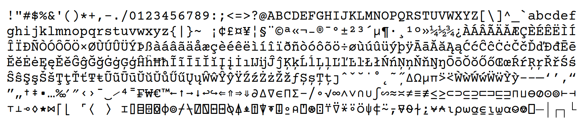

# Courier FZR APL

A Courier style font with support for programming languages in the APL family

the following image showcases the alignment and consistency relationships between glyphs.
The choice of categories and glyphs is taken from [the APL wiki](https://aplwiki.com/wiki/Fonts#Designing_a_font)
and the greyed out glyphs are those not yet provided by the font.

*warning* the list below is not comprehensive as the script I was using to query the supported glyphs is bugged and I don't
really want to list them by hand (especially not having a keyboard layout that includes all of them). I'll fix it when I have
the time to.

Most of the supported glyphs, including those originally contained in the Courier Prime font:

Any suggestions for addition and restyling of glyphs are welcome.
