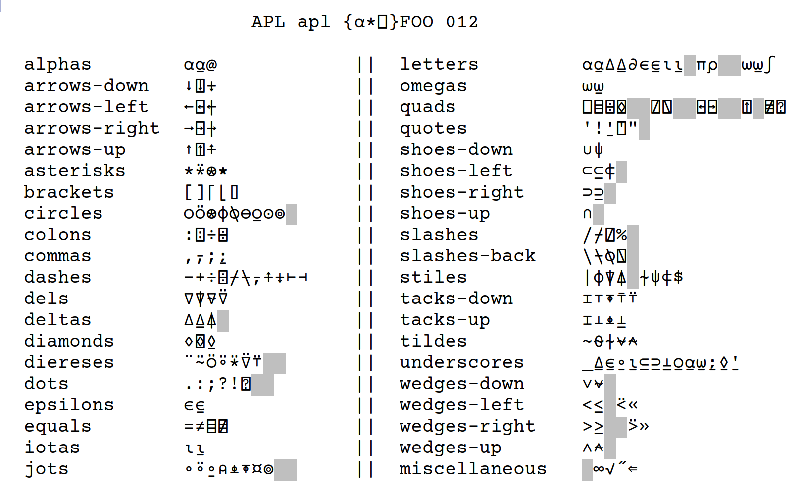

# Courier FZR APL

A Courier style font with support for programming languages in the APL family

the following image showcases the alignment and consistency relationships between glyphs.
The choice of categories and glyphs is taken from [the APL wiki](https://aplwiki.com/wiki/Fonts#Designing_a_font)
and the greyed out glyphs are those not yet provided by the font.

Any suggestions for addition and restyling of glyphs are welcome.
